# Boxy SVG

Scalable Vector Graphics editor

Boxy SVG project goal is to create the best tool for editing SVG files.

For beginners as well as for professional web designers and web developers.

On any device and operating system.

\[Note: [Firefox is not supported.](https://anonym.to/?https://boxy-svg.com/ideas/227/firefox-browser-support)\]

## Features

<!--
find storage/artworks/-Mfmib4taXaHpujTANsc.*.png | while read png; do
  echo "    <td>"
  echo "      <a href=\"#\">"
  echo "        "
  echo "      </a>"
  echo "    </td>"
done
-->

<table>
<table><tbody>
  <tr>
    <td>
      
    </td>
    <td>
      
    </td>
    <td>
      
    </td>
    <td>
      <a href="#advanced-typography">
        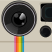
      </a>
    </td>
    <td>
      
    </td>
    <td>
      
    </td>
    <td>
      <a href="#assets-library">
        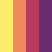
      </a>
    </td>
    <td>
      
    </td>
    <td>
      <a href="#reusable-symbols">
        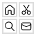
      </a>
    </td>
  </tr>
</tbody></table>

### Intuitive user interface

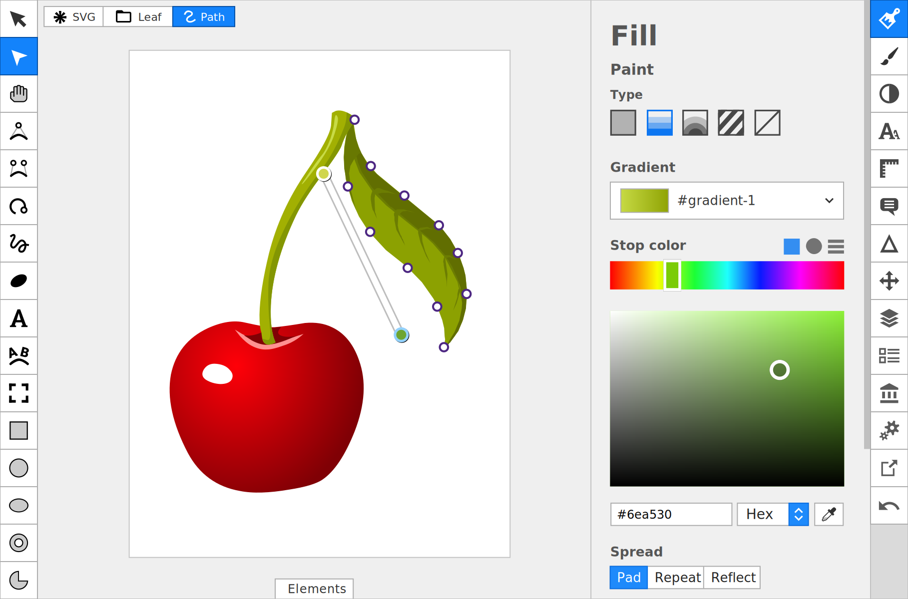

Boxy SVG is built around the idea that user interfaces should get out of the way. There is no crowded workspace with overlapping dialogs or dozens of opened palettes and toolbars. Your illustration takes the center stage.

Whether it's the editing of shapes or adjustment of gradient fills, most of the action is taking place directly on the canvas. Fine control over the changes is available in panels that you can expand and then collapse with a single click or key press.

Many features are accessible with keyboard shortcuts that you can customize to your liking. This is especially useful if you are coming with a lot of muscle memory from years of using other vector graphics editors.

### Native SVG support

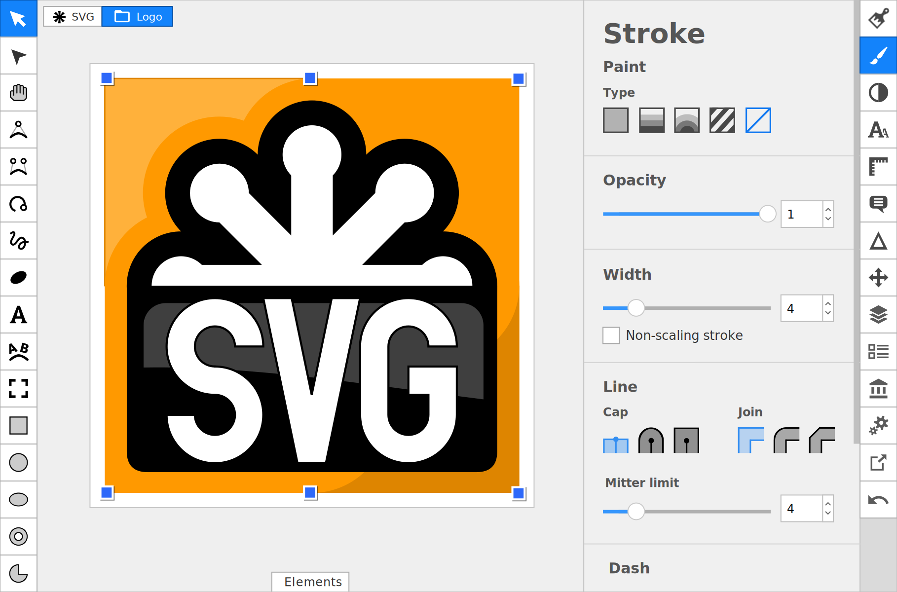

Boxy SVG uses Scalable Vector Graphics (SVG) as its native document format. With SVG, there is no vendor lock-in. It's an open standard for the web just like HTML5 and CSS. It is developed by the World Wide Web Consortium and has multiple stakeholders from a variety of industries.

You do not need to store your original document in a proprietary file format, constantly export to SVG and clean it up every time before you can use it. Just create a new illustration or open an existing one, draw, save. That's all.

All your documents made with Boxy SVG are 100% standard-compliant. They can be edited with other authoring software and will be rendered correctly in most desktop and mobile web browsers as Boxy SVG is powered by the Chromium engine.

The program also makes it easy to create illustrations that are instantly ready for publishing on the web. Boxy SVG automatically keeps track of unused definitions like gradients and patterns and removes them to keep the final SVG code clean and cruft-free.

Additional options give you control over the indentation of SVG code, as well as over geometry and transformation precision that also affects the size of final documents.

### Filter effects

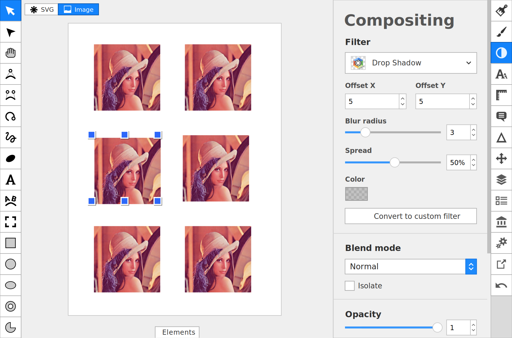

Apply visual effects on bitmap and vector objects alike using SVG Filters. Boxy SVG comes with 20+ preset filters for common use cases like:

- Color manipulation, e.g. "Grayscale", "Sepia" and "Duotone"
- Distortion, e.g. "Motion Blur", "Warp" and "Morphology"
- Decoration, e.g. "Drop shadow", "Spot light" and "Outline"

All preset filters have user-friendly descriptive settings. Any changes you make are rendered on the canvas immediately and can be tweaked at any time later. Simply open the "Compositing" panel, select an object with a filter, and make further adjustments.

You can take it to the next level and construct your own filters. Boxy SVG provides an easy-to-use interface to build complex effects from low-level primitives. Open the "Defs" panel, create a custom SVG filter, add some filter primitives, then organize them into a graph with instant preview on the canvas.

All SVG filters are supported natively in most web browsers. You won't have to export your illustrations to bitmaps or write complex JavaScript code to display them correctly on a website.

### Advanced typography

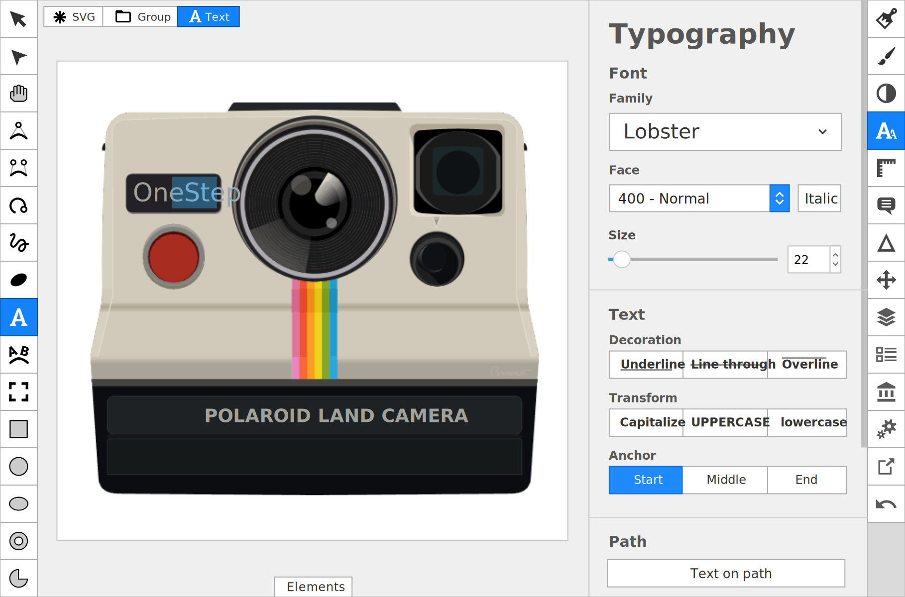

Create beautiful captions using any of the 1,000+ fonts available in the Google Fonts directory or import and embed WOFF, TTF, and OTF font files from your disk.

Take complete control over the styling of text. Apply underline, strikethrough, and overline decorations, use various letter case options, apply flat, gradient, or pattern fills and strokes.

Use spacing options to control the space between all characters, words, and lines, or use the Edit tool to freely reposition any glyph.

Create text on path with just a single click and tweak its offset to find the optimal position of the text on the curve.

### Developer tools

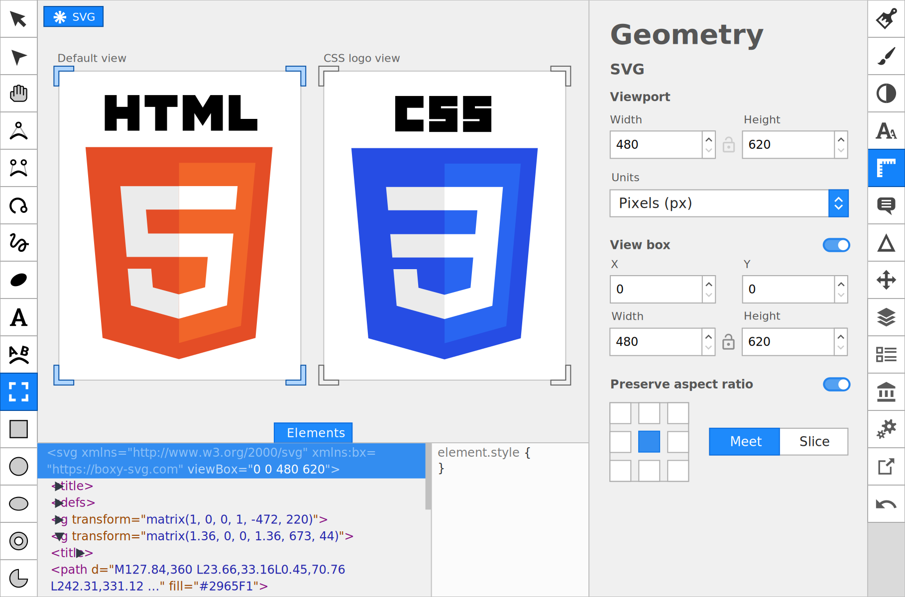

Inspect the underlying SVG and CSS code easily with the built-in "Elements" panel. The principle is the same as with web developer tools available in popular web browsers.

You can use the "Elements" panel to edit both SVG and CSS code in-place. The canvas and the code inspector are in a perfect sync: as you make a change in one of them, the other one automatically updates its contents.

The inspector also makes it possible to copy and paste SVG code snippets between Boxy SVG and external programs like text editors.

### Export options

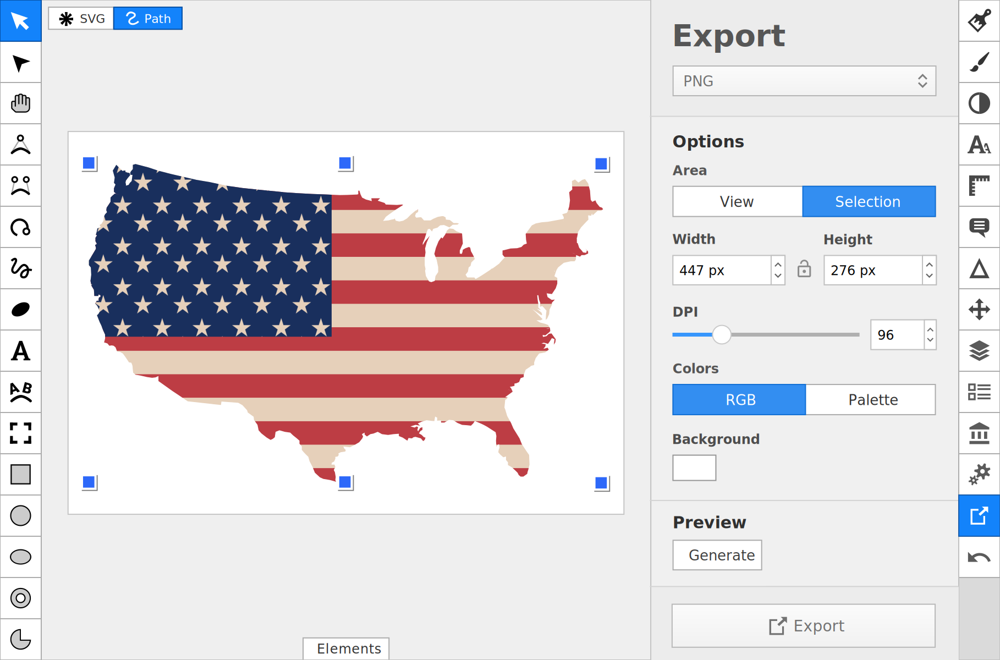

Take your work easily to delivery file formats like PNG, JPEG, GIF, WebP, and PDF. For each supported file type, Boxy SVG provides format-specific exporting options such as compression, resolution, background color, and many others.

When saving to SVG, you can minimize the file size by optionally removing embedded fonts and non-standard markup elements.

For all file types, you can manually set the exporting area or quickly switch between exporting all objects and just the current selection.

The "Preview" section provides an overview of the final rendering and calculates the file size to help you optimize for the web.

### Assets library

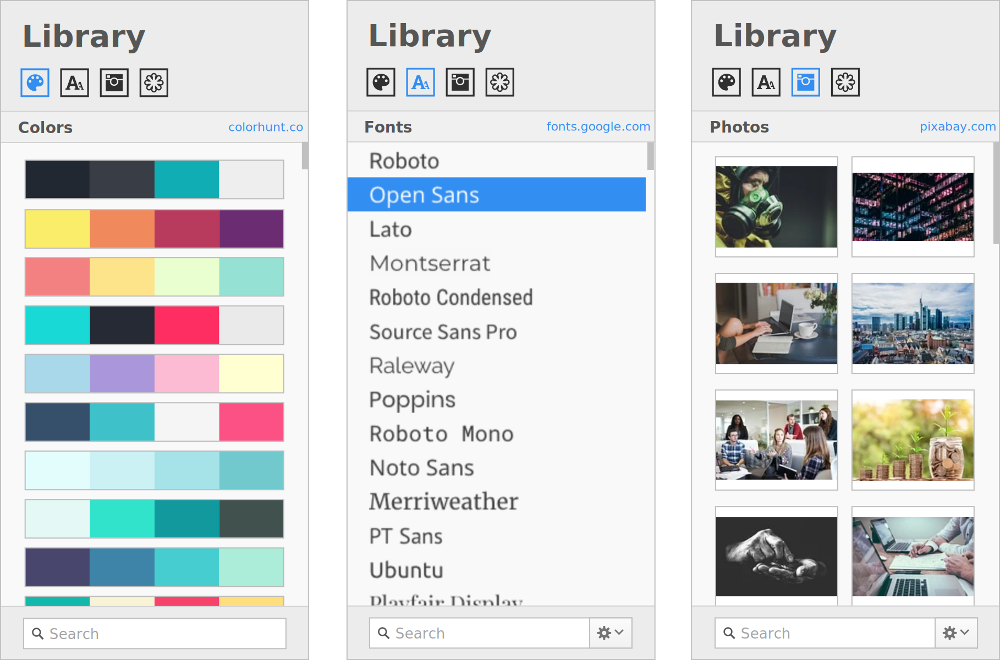

Access millions of high-quality stock photos and vector illustrations from Pixabay, hundreds of color palettes from ColorHunt, and over a thousand fonts from the Google Fonts directory.

Do you need a sans serif font with characters from the Greek alphabet or maybe all vectors with shoes in the "Sports" category? Search for a keyword to make an initial selection, then apply a quick filter to narrow down the search results. Once you found the asset you like, simply drag and drop it onto the canvas to use.

All assets are released under permissive licenses and can be used in commercial projects freely, without paying royalties.

### Image tracing

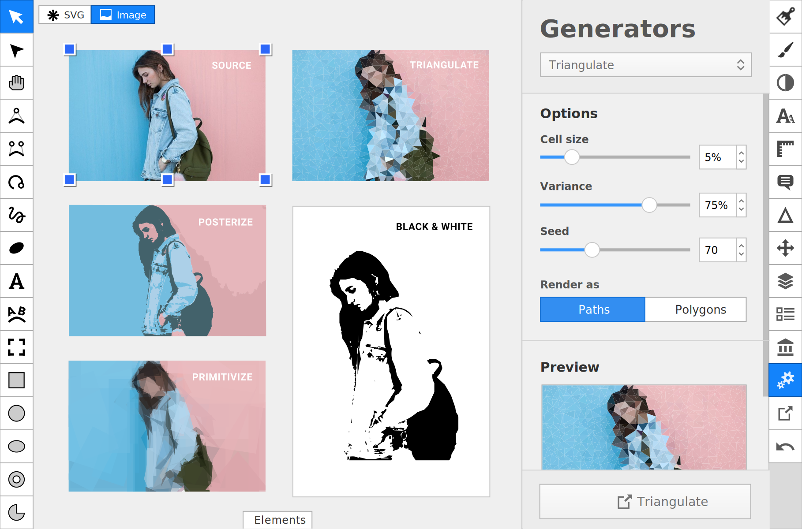

Boxy SVG provides convenient tools to create vector graphics out of bitmaps, with a variety of stylistic approaches.

Use the Vectorize generator to create a scalable drawing that looks as close as possible to the original bitmap. Pick a preset like "Greyscale" or "Posterized" or use advanced options that provide full control over vectorization.

Choose the Pixelate generator to create a pattern of large color blocks similar to the mosaic effect.

Use the Triangulate or the Primitivize generator to create a scalable variation of the original bitmap image with approximation to basic geometric shapes like triangles.

### Reusable symbols

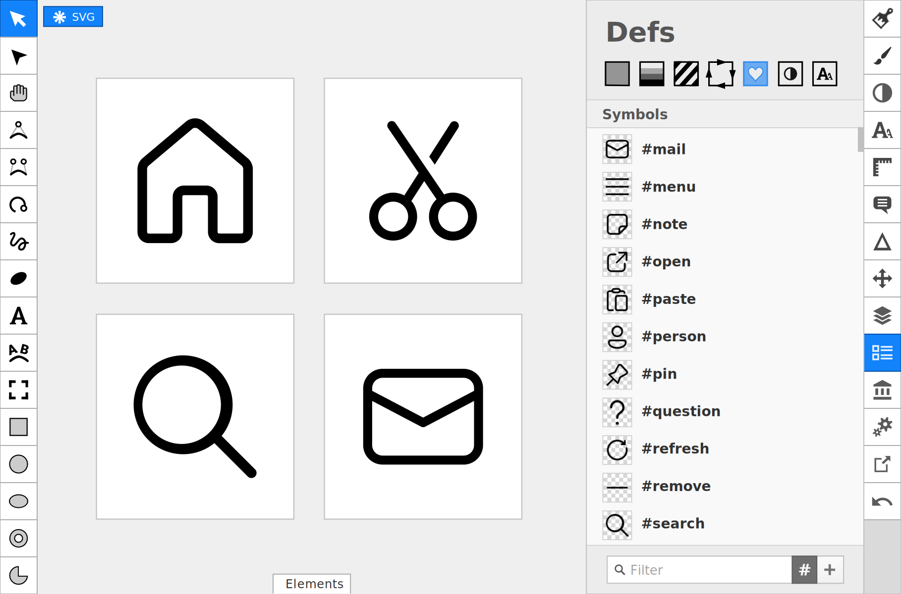

Use the "Defs" panel to manage SVG symbols. It takes just a click or two to create and edit new symbols, rename their IDs and titles.

Drag and drop a symbol from the "Defs" panel into canvas to create its instance. All instances of a symbol will automatically update once you change the original.

Boxy SVG is also fully capable of editing SVG sprites which are used to store complete icon sets on the web. For really large sprites you can use the filter option to locate symbols by their names or IDs.

Advanced control over each symbol view box and viewport is provided by the "Geometry" panel.

## Live demo

Click an SVG file thumbnail below to open it with Boxy SVG editor.

<!--
url="https://milahu.github.io/boxy-svg/app/?import-from-url=https://github.com/milahu/boxy-svg/raw/main/"
find storage/ -type f -name '*.svg' | while read svg; do
  title=$(grep -m1 '<title>' $svg | sed -E 's|^.*<title>(.*?)</title>.*$|\1|')
  [ -z "$title" ] && continue
  png=${svg%.svg}.png
  echo "    <td>"
  echo "      <a href=\"$url$svg\">"
  echo "        "
  echo "      </a>"
  echo "    </td>"
done
-->

<table><tbody>
  <tr>
    <td>
      
    </td>
    <td>
      <a href="https://milahu.github.io/boxy-svg/app/?import-from-url=https://github.com/milahu/boxy-svg/raw/main/storage/artworks/-LYgyzb88SCpJUl7gX90.svg">
        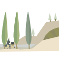
      </a>
    </td>
    <td>
      <a href="https://milahu.github.io/boxy-svg/app/?import-from-url=https://github.com/milahu/boxy-svg/raw/main/storage/artworks/-LZTc2une_8JtTkYo-5f.svg">
        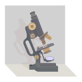
      </a>
    </td>
    <td>
      
    </td>
  </tr>
  <tr>
    <td>
      
    </td>
    <td>
      
    </td>
    <td>
      <a href="https://milahu.github.io/boxy-svg/app/?import-from-url=https://github.com/milahu/boxy-svg/raw/main/storage/artworks/-LZTcQ2XxWmLFiMHIif_.svg">
        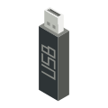
      </a>
    </td>
    <td>
      
    </td>
  </tr>
  <tr>
    <td>
      
    </td>
    <td>
      
    </td>
    <td>
      
    </td>
    <td>
      
    </td>
  </tr>
  <tr>
    <td>
      <a href="https://milahu.github.io/boxy-svg/app/?import-from-url=https://github.com/milahu/boxy-svg/raw/main/storage/artworks/-LZT_IJcQVKTJ6OK_ar8.svg">
        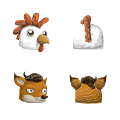
      </a>
    </td>
    <td>
      <a href="https://milahu.github.io/boxy-svg/app/?import-from-url=https://github.com/milahu/boxy-svg/raw/main/storage/artworks/-LZTahHRSRXnFr1RaHZC.svg">
        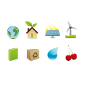
      </a>
    </td>
    <td>
      
    </td>
    <td>
      <a href="https://milahu.github.io/boxy-svg/app/?import-from-url=https://github.com/milahu/boxy-svg/raw/main/storage/artworks/-LZTfGP2359sW4GS4dxb.svg">
        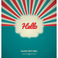
      </a>
    </td>
  </tr>
</tbody></table>

## source

stolen from [boxy-svg.com](https://anonym.to/?https://boxy-svg.com/)

censored in 3... 2... 1...

### mirrors

- [darktea.onion](http://it7otdanqu7ktntxzm427cba6i53w6wlanlh23v5i3siqmos47pzhvyd.onion/milahu/boxy-svg)
- [righttoprivacy.onion](http://gg6zxtreajiijztyy5g6bt5o6l3qu32nrg7eulyemlhxwwl6enk6ghad.onion/milahu/boxy-svg)

## changelog

- import image from url: set attribute data-source
  - otherwise image would have only width, height and a base64 string
- disable cloud functions
  - dont run code on google servers. make this work offline first
  - use cors proxies to fetch images
- add import-from-url parameter
  - allow opening image from url
  - [demo](https://milahu.github.io/boxy-svg/app/?import-from-url=https://github.com/milahu/boxy-svg/raw/main/images/boxy-svg.svg)
- remove: file -> export -> pdf
  - this seems to require cloud functions, but pdf can be generated by: file -> print -> save as pdf
- fix darkmode
  - use transparent workspace by default
  - use darker workspace background
  - adwaita-dark theme: use darker checkerboard pattern
- dont require login
  - allow: file -> export
    - based on [greasyfork.org/en/scripts/418981-boxy-svg-com-bypass](https://greasyfork.org/en/scripts/418981-boxy-svg-com-bypass)
  - allow: file -> save
    - remove: file -> download. same as: file -> save
    - TODO restore file -> save. this (chromium filesystem api) works on github pages over https, but not on localhost over http. probably also works in electron
- use relative paths to make it work on github pages
  - see [scripts/patch-absolute-paths.sh](scripts/patch-absolute-paths.sh)
- decompile the javascript code
  - see [scripts/webcrack.sh](scripts/webcrack.sh)
  - see [scripts/wakaru.sh](scripts/wakaru.sh)
  - see [scripts/prettier.sh](scripts/prettier.sh)
- move html files from `/app` to `/app/index.html` etc
  - see [scripts/move-html-files.sh](scripts/move-html-files.sh)
